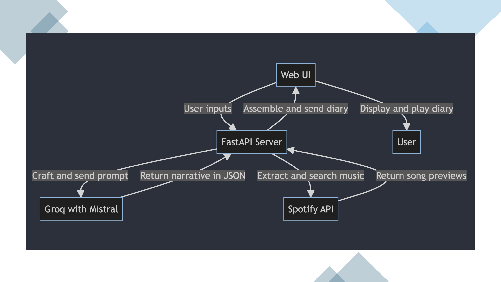
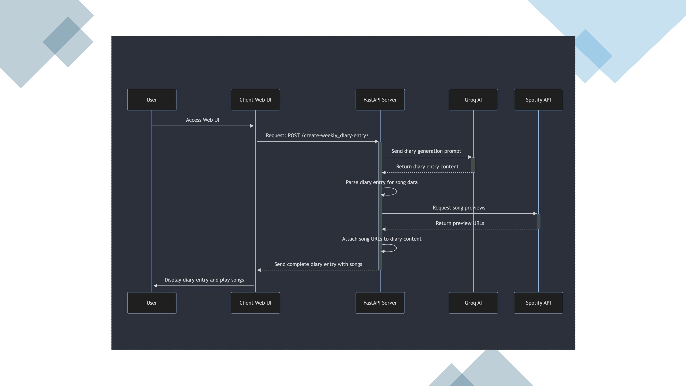
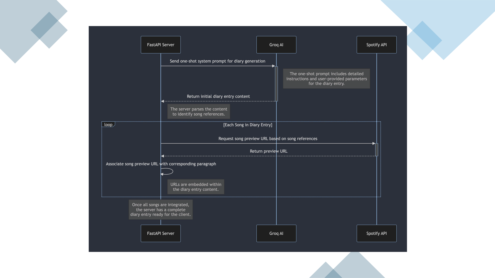
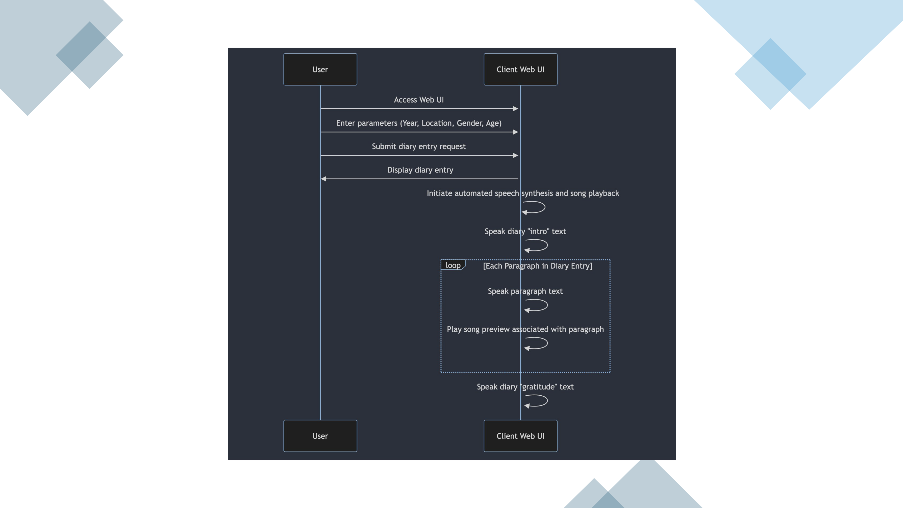

# Time Traveling with AI</h1><h2>Capturing Past Voices</h2>

[Opening shot of the presenter in a well-lit, comfortable setting]


<!-- NOTES:
Hello everyone, and welcome back to our channel! In our journey so far, we've dived into the fascinating world of language models and explored a myriad of features. From capturing spoken words with precision with speech recognition, to having text spoken with speech synthesis, we've seen how we can interact with AI in ways that were once pure science fiction.
-->

---

# Feature List

### <span style='color: green; font-size: 2em;margin-right: 0.5em;'>✓</span>Capturing our words, Speech Recognition

### <span style='color: green; font-size: 2em;margin-right: 0.5em;'>✓</span>Repeating them back, Speech Synthesis

### <span style='color: green; font-size: 2em;margin-right: 0.5em;'>✓</span>Another voice, LLM Integration

### <span style='color: green; font-size: 2em;margin-right: 0.5em;'>✓</span>True conversation, Waking the LLM with memory

.

<!-- NOTES:
We've gone step by step through the process – how to listen and respond, and how to elevate those interactions into meaningful conversations with AI, such as OpenAI's ChatGPT, Anthropic's Claude, and Inflection's... or should I say Microsoft's, Hey Pi model.


-->

---

<div style='width: 100%; height:100%; background: url(./OpenaiAnthropicInflection.png) no-repeat; background-size: contain; background-position: center; '></div>

<!-- NOTES:
But these are all just features — incredible features, yes, but still individual pieces of a larger puzzle. Today, we're shifting gears from the singular capabilities to the big picture.

In this video, we're going to show you how all these elements come together to create not just a feature, but a complete product. A product that leverages the combined strength of these features to deliver an experience.

So, if you're interested in looking at how this can be done, stick around, and let's get started!"
-->

---

# Starting with a concept

## Eternal Dreams Radio

### A portal to the past


<!-- NOTES
First of all we need imagine,

Think about, being able to time travel, not through the physical world, but through the power of voice and sound. Imagine being able to hear the intimate thoughts and events of someone's life from decades ago as if you were right there with them

The product we aim to build will allow us to experience the world through the weekly diary entries of people from different times. To be able to immerse ourselves in their stories, feel the pulse of the events they lived through, and even share the melodies that moved them.

We'll give the product a name 'Eternal Dreams Radio'.

Our solution uses language models to resurrect the lost voices of history, adds layers of context with events of the times, and for that extra touch of authenticity, it adds songs from the era, completing the ambiance of the diary entries.
-->

---

# The Technical Detail

## The System Prompt

Your role is, that given an age, a gender, a location and a year, to produce a weekly diary entry, for an individual, based on the age, location and year properties provided. The Individual should reflect on the past week, discussing the current events at the provided location and provided year and their own concerns. Begin with the individual introducing themselves, mentioning the year, where they live, and their occupation. The introduction should be followed by a continued story of 300 words in three paragraphs. In each paragraph, the individual should mention a song and its artist popular in the year provided and that matches the paragraph"s vibe. Conclude by adding a section to express the individuals gratitude for the opportunity to share the week"s experiences. The choice of songs should follow there rules [ 1. song must match the vibe of the paragraph. 2. songs release date must be in or before the provided year. 3. at least two of the songs should be in the language of the location provided.

<!-- NOTES
So enougth with floating thoughts, lets get down to the technical detail. How are we going to do this?
Let's take the easy way, we'll ask the LLM to do it.
Our task then, is to guide the LLM to recount tales from a bygone era, complete with emotions, events, and even music. But how do we get the LLM to do this? The answer lies in a meticulously crafted system prompt.
-->

---

# The Technical Detail

## Structuring using the System Prompt

### Write the response in json in the following format.

```json
{
	"diaryentry": {
		"intro": "introduction",
		"paragraphs": [
			{
				"paragraph": "paragraph",
				"song": "song",
				"artist": "artist",
				"release date": "Release Date"
			}
		],
		"gratitude": "gratitude"
	}
}
```

<!--NOTES
So the LLM returns the diary entry and it would be quite straight forward to just pass the output to a speech synthesis enabled function but to truly step back in time, we crave the ambiance only music can provide. A spoken diary is one thing; an auditory experience with era specific melodies is quite another. So, how do we conjure up these tunes from text? The solution lies in a musical oracle, or rather music library services api.

However to harness the api, we need more than just text, we need specific arguments. Extracting song titles and artist names from a block of narrative text doesn't sound fun. So we ask ourselves, 'Why not let the LLM do the heavy lifting?'

In update our system prompt to include a request for structured output asking the AI, to give us not just prose, but JSON; with tags for each melody and its artist. And just like that, the AI delivers.

This technique of guiding the LLM to format unstructured data into a structured one is a true game-changer. It's an nice step that brings us back to familiar teritory and allows us to interact with a music service using their API.

At this point we're ready to look at the overal components and workflow.
-->

---

# Components and Workflow



<!-- NOTES
For the user interaction we will use plain html, css and javascript.
FastAPI for delivering the ui, taking the user requests and for interacting with the AI and the Music Service
Groq wth Mistral will be our dependable LLM and
Spotify our Music Library

The create diary request is made from the Web UI
The FastAPI server takes the request, crafts a systme prompt and sends it to Groq
Groq returns the Diary Narative in JSON format and the songs and artists are extracted
FastAPI searches for the song and artists using the Spotify API
FastAPI puts it all together and returns the Diary Entry to the WebUI
The WebUI plays the diary, using the browsers speech synthesis api for speech, and the  audio component to play the songs.

and we can quikly look at [Move to next slide]
-->

---

# Solution Detail



<!-- NOTES
The solution detail
-->

---

# Server Detail



<!-- NOTES
The server detail
The server does the most heavy lifting it crafts the prompt given the arguments and manages the call to the AI which in this case is Groq. The extraction of the songs and artists and is quite straight forward because we are detailing with json but the call to Spotify is a litle more complex and there are some setup steps to go through before we can use the api which include creating a Spotify developer account, creating the api keys. Once we have these its a matter of working out how to call the api to get an access token and how to call the api to search for the song preview urls. We're come back to that later on. Everything is put together and returned to the client.
-->

---

# Client Detail



<!-- NOTES
and the client detail.
All the client has to do is play the returned diary entry which can be done usingthe speech synthesis api we looked at in earlier presentations and using the audio component to play the song urls. Using the audio component is more or less the same as the speech synthesis.


-->

---

# Technical focus on Spotify - Get the access token

```python
def spotify_get_access_token():
    """
    Get Spotify access token.
    """
    client_id = os.getenv("SPOTIFY_CLIENT_ID")
    client_secret = os.getenv("SPOTIFY_CLIENT_SECRET")
    credentials = base64.b64encode(f"{client_id}:{client_secret}".encode()).decode()
    headers = {
        "Authorization": f"Basic {credentials}",
        "Content-Type": "application/x-www-form-urlencoded",
    }
    data = {"grant_type": "client_credentials"}

    try:
        response = httpx.post(
            "https://accounts.spotify.com/api/token", headers=headers, data=data
        )
        response.raise_for_status()  # Raises an httpx.HTTPStatusError for 4xx/5xx responses
        return response.json()["access_token"]
```

<!-- NOTES
As promised, let's take a quick look at the Spotify specifices, bascically how to get the access token and how to serach for the songs.
I will leave a link in the description to Spotify's developer page where you can sign up and get your api tokens.

With the get access token you can see its just a matter of setting up the authorization header with the right information and making the call.

Once you have the access token we're ready for the seach call.

-->

---

# Technical focus on Spotify - Searching for songs

```python
def spotify_get_songs_preview_url(search_criteria, access_token):
    """
    Retrieves the Spotify preview URL of tracks based on the search criteria.
    """
    auth_header = {"Authorization": f"Bearer {access_token}"}
    search_url = "https://api.spotify.com/v1/search"
    params = {"q": search_criteria, "type": "track", "limit": 5}
    try:
        response = httpx.get(search_url, headers=auth_header, params=params)
        response.raise_for_status()

        search_results = response.json()
        tracks = search_results["tracks"]["items"]
        preview_url = None
        if tracks:
            for track in tracks:
                if track["preview_url"]:
                    # Return the first preview URL found
                    preview_url = track["preview_url"]
                    break
        return preview_url
```

<!-- NOTES

Again, once we're familia with the code, the steps are straight forward, inculding our access token we populte our search criteria and make the call and grab the first preview_url that is filled. Sometimes, a song will have no preview_url, and in that case, as there is no url, the song will not be played.

Having explored the intricate workings of our system, let’s shift from theory to practice. It’s one thing to discuss the technical architecture and quite another to see it in action. Let’s dive into a live demonstration of our solution.
-->

---

# Demo

<div style='height: 100%; display: grid; grid; grid-template-columns: 1fr 1fr;'>
<div style='width: 100%; height:100%; background: url(./demo.png) no-repeat; background-size: contain; background-position: center; '></div>
<div style='width: 100%; height:100%; background: url(./demo_playing.png) no-repeat; background-size: contain; background-position: center;'></div>
</div>

<!--
As we prepare to dive into the past, let’s set the stage for our journey. Today, we’ll be requesting a weekly audio diary from the year 1989, set in the vibrant city of Milan. Our fictional narrator for this journey is a 28-year-old man whose experiences and thoughts have been brought to life through the power of our AI-driven system.

[Show the input fields being filled: ‘1989’, ‘Milan’, ‘Male’, ‘28’]

Before I initiate this time travel, there's an important note on authenticity and audio content. While our diary will mention and play the specific songs that defined the era and our character’s life in 1989, the actual audio you'll hear, on youtube, isn't. To navigate around copyright issues, we’ve replaced them with a selection of copyright-free music from YouTube's audio library. This means you can enjoy the experience without any interruption or legal concerns.

Watch for the 'Song Playing' notification right here in the bottom right of your screen whenever a track starts playing.

Alright, with all set, let’s make our request to the past and listen to what a week in 1989 Milan was like for our young man."

[Click ‘Submit’ or equivalent action, initiating the request]

[As the diary entry plays, show visual cues for song mentions and changes]

[As the diary entry and music play, periodically highlight the 'Song Playing' notification]

[After the demo]

And there you have it—a seamless blend of history, personal storytelling, and music, all brought together by AI and web technologies. This demo not only showcases the technical capabilities we have learnt but also the creative possibilities it unlocks for experiencing history in a new and immersive way."

[Transition to closing remarks]

"This is just the beginning of what we can achieve with AI in the realm of audio storytelling. Thank you for joining me on this temporal journey. Stay tuned for more explorations, and don't forget to like, subscribe, and share if you enjoyed this trip down memory lane."
-->
